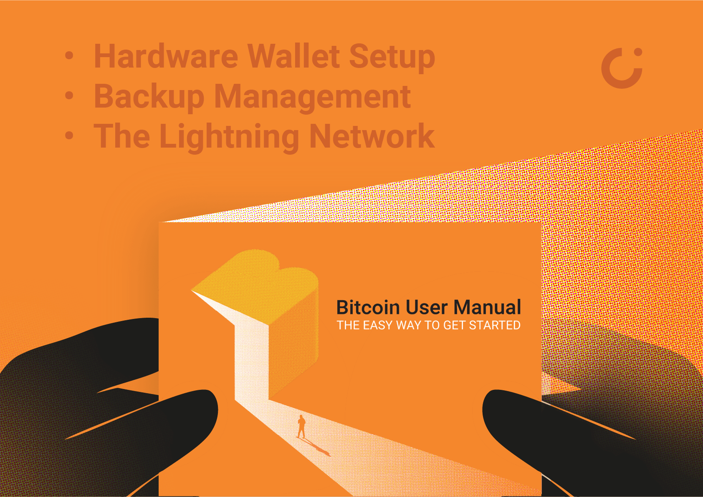

  

# Bitcoin User Manual Booklet

Jesteś w repozytorium "Bitcoin User Manual Booklet". Ta przygotowana przez Cryptosteel publikacja stanowi składową zestawów z serii [MotherLode](https://cryptosteel.com/product/motherlode-crypto-starter-kit/) obejmujących trzy temperatury portfeli kryptowalut. Publikacja została stworzona z myślą o osobach początkujących, ale wierzymy, że także doświadczeni użytkownicy Bitcoina znajdą w niej interesujące treści. Mogą one być wykorzystane do celów szkoleniowych dla osób, które dopiero rozpoczynają swoją przygodę z Bitcoinem.

## Opis publikacji

Książka "Bitcoin User Manual Booklet" tłumaczy, w sposób pragmatyczny, jak krok po kroku:

- skonfigurować portfel sprzętowy (Cold Storage), 
- wykonać trwały backup frazy odzyskiwania (Deep Frozen Backup),
- korzystać z szybkich płatności Lightning Network (Hot Spending Account). 

Ponieważ zależy nam na podnoszeniu poziomu bezpieczeństwa i edukowaniu użytkowników, postanowiliśmy udostępnić ją na licencji [Creative Commons Attribution 3.0 Unported (CC BY 3.0)](./LICENSE.md).

**Oznacza to, że każdy może ją bezpłatnie pobrać, modyfikować, korzystać z niej i dzielić się nią, pod warunkiem, że poda źródło.**

Nasza publikacja została skonstruowana w taki sposób, aby można było ją łatwo przetłumaczyć i dostosować do lokalnych warunków, w których będzie używana.

Zachęcamy do modyfikacji elementów takich jak:

- lokalne giełdy i inne możliwości wymiany kryptowalut,
- portfele sprzętowe popularne w danym regionie,
- popularne lokalnie metody tworzenia metalowych kopii zapasowych,
- aplikacje Lightning, które cieszą się popularnością w danym obszarze.

## Co znajduje się w repozytorium?

Na repozytorium składają się różne wersje językowe publikacji. Każda z nich zawiera:

- pełną wersję książki w formacie PDF - idealnej do pobrania i czytania,
- książkę podzieloną na rozdziały w oddzielnych, łatwych do edycji plikach - pozwala to społeczności łatwo zgłaszać sugestie i ewentualne poprawki,
- ilustracje - w formie zamkniętej i otwartej do edycji.

## Dostępne wersje językowe

Na początek udostępniamy książkę w trzech językach, ale z czasem planujemy dodać więcej wersji językowych. Nie ukrywamy, że w pracach nad innymi wersjami liczymy na pomoc społeczności!

|Publication Language|Kliknij okładkę, aby przejść do odpowiedniego folderu|
|---|---|
|English||
|Czech||
|Polski||

## Licencja

Książka “Bitcoin User Manual Booklet” i związane z nią repozytorium (dostępne pod adresem: https://github.com/cryptosteel/Bitcoin-User-Manual-Booklet/) zostały udostępniane na licencji Creative Commons Attribution 3.0 Unported (CC BY 3.0). 

## Kontakt z nami

Jeśli masz jakieś pytania lub chcesz zgłosić swoje sugestie, skontaktuj się z nami pod adresem motherlode.booklet@cryptosteel.com.

## Wkład społeczności

Zachęcamy wszystkich do zgłaszania swoich sugestii i pomocy w tłumaczeniu naszej książki na inne języki.

**Cryptosteel**
*The Mother of All Backups*